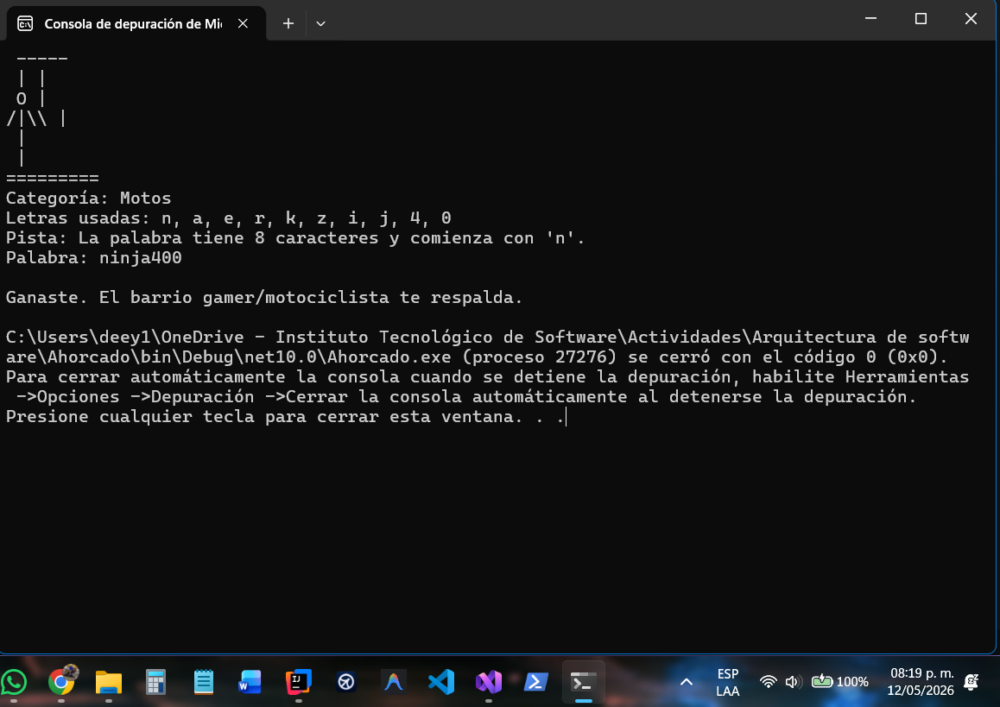
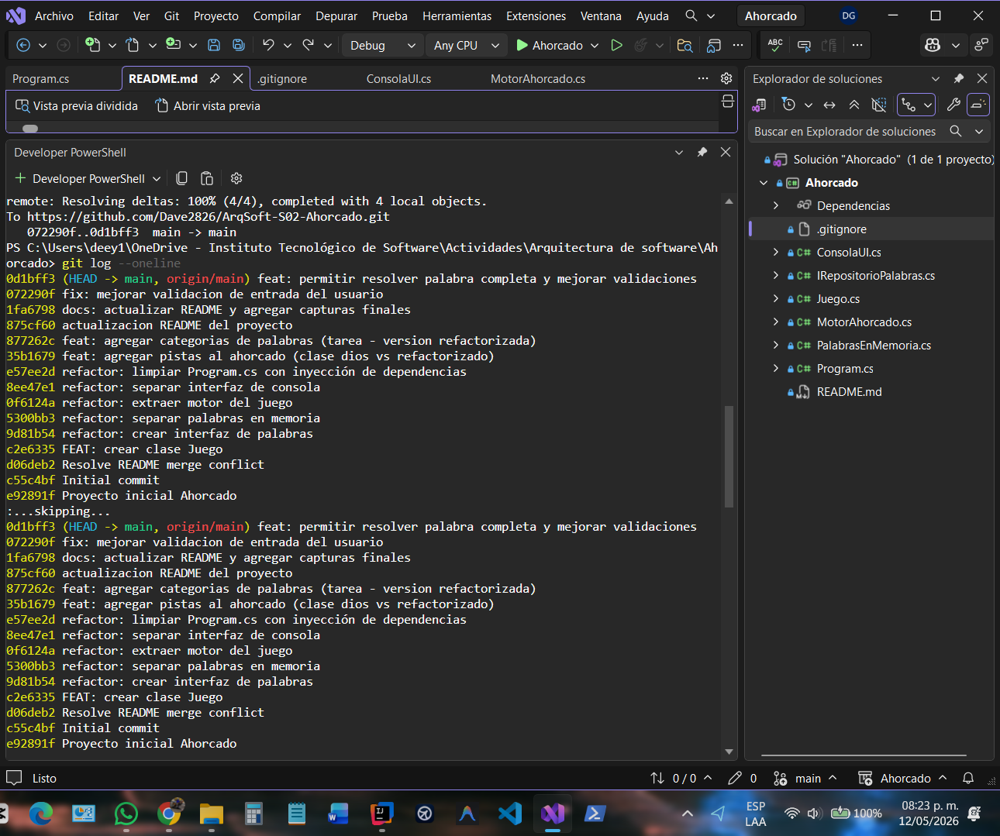
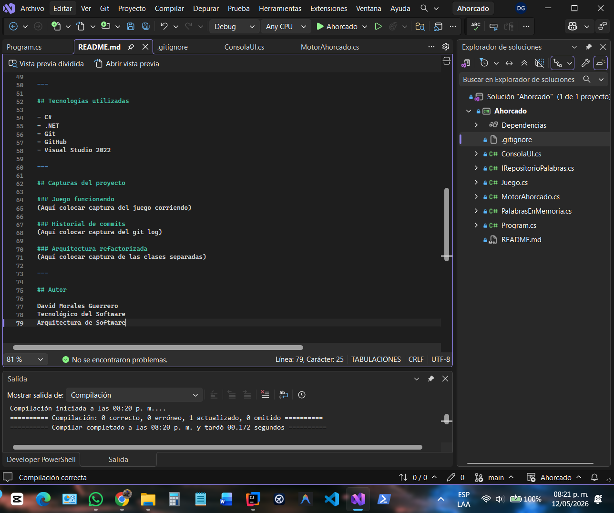

# Ahorcado - Arquitectura de Software

Proyecto desarrollado en C# para demostrar la evolución de una clase dios hacia una arquitectura basada en principios SOLID.

---

## Objetivo

Aplicar refactorización progresiva utilizando buenas prácticas de arquitectura de software y control de versiones con Git y GitHub.

---

## Principios SOLID aplicados

- SRP (Single Responsibility Principle)
- OCP (Open/Closed Principle)
- DIP (Dependency Inversion Principle)

---

## Refactorizaciones realizadas

- Separación del repositorio de palabras
- Extracción del motor del juego
- Separación de la interfaz de consola
- Implementación de inyección de dependencias
- Mejora de Program.cs como orquestador principal

---

## Funcionalidades

- Juego de ahorcado en consola
- Sistema de pistas
- Categorías aleatorias
- Registro de letras usadas
- Control de intentos
- Mensajes personalizados
- Historial de commits profesional

---

## Categorías disponibles

- Programación
- Videojuegos
- Motos
- Heroes

---

## Tecnologías utilizadas

- C#
- .NET
- Git
- GitHub
- Visual Studio 2022

---

## Capturas del proyecto

### Juego funcionando

### Historial de commits

### Arquitectura refactorizada

---

## Uso de IA.

Durante el desarrollo del proyecto se utilizó inteligencia artificial como apoyo técnico y guía de aprendizaje en momentos específicos, principalmente para resolver errores, comprender conceptos de refactorización, organizar commits y mejorar la estructura del código.

---
## Autor

David Morales Guerrero  
Tecnológico del Software  
Arquitectura de Software