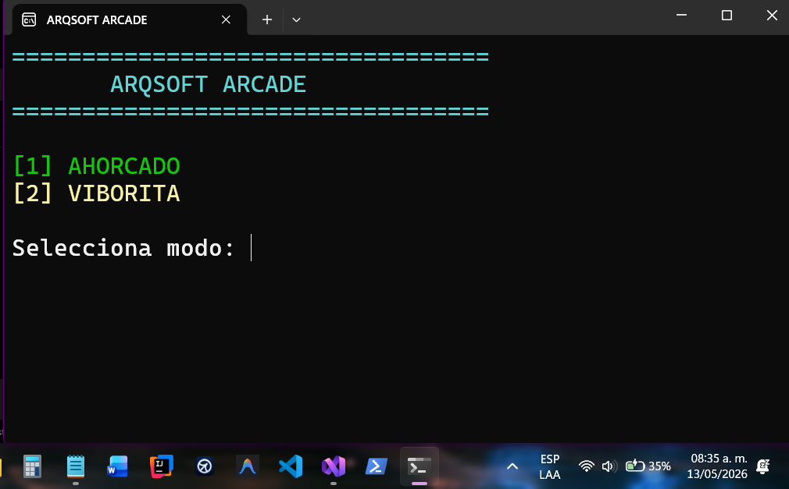
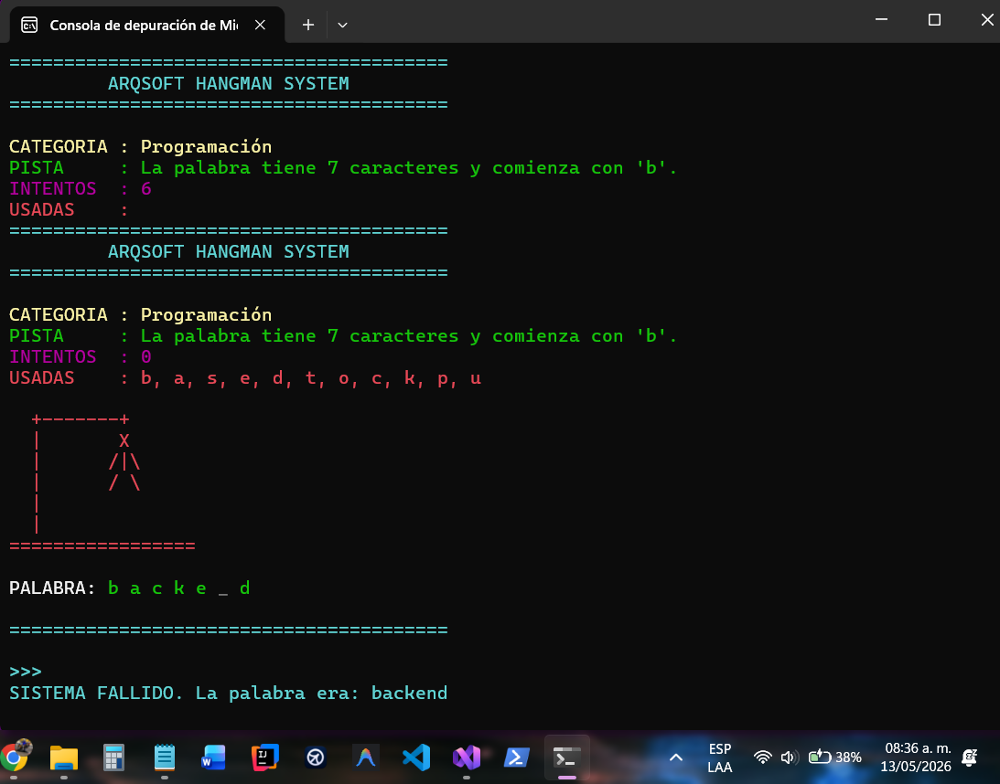
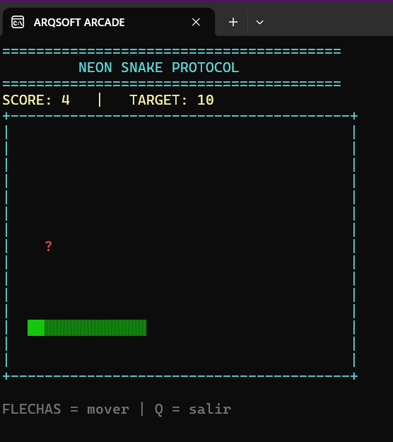
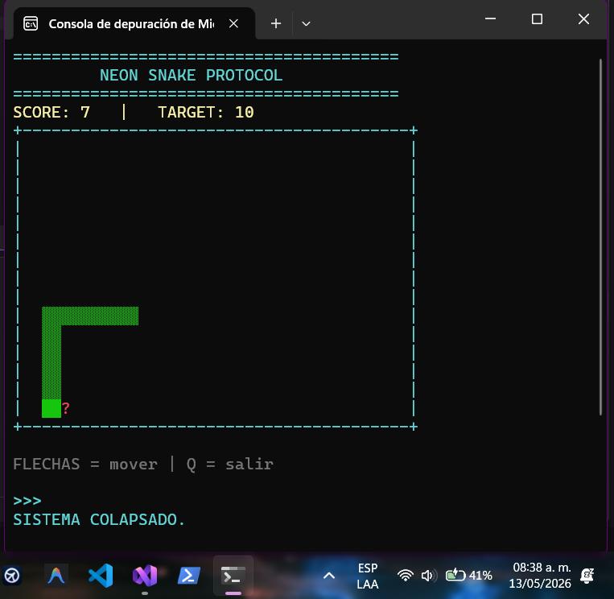

# ARQSOFT ARCADE

Proyecto desarrollado en C# como práctica de Programación Orientada a Objetos, lógica de videojuegos en consola y control de versiones con Git y GitHub.

El proyecto integra dos modos de juego dentro de una misma aplicación de consola:

- Ahorcado
- Viborita (Snake)

La interfaz fue personalizada con una estética futurista tipo arcade/cyberpunk utilizando colores, ASCII art y mejoras visuales en consola.

---

# Modos de juego

## 1. Ahorcado

Modo clásico de adivinanza de palabras con:
- categorías dinámicas
- pistas
- control de letras usadas
- validación de entradas
- sistema de intentos
- interfaz visual personalizada

### Características
- palabras almacenadas en memoria
- pistas automáticas
- detección de victoria y derrota
- arte ASCII del ahorcado
- mensajes dinámicos estilo arcade

---

## 2. Viborita (Snake)

Juego de viborita desarrollado en consola utilizando:
- movimiento en tiempo real
- detección de colisiones
- generación de comida aleatoria
- sistema de puntos
- velocidad progresiva

### Características
- tablero dinámico
- dificultad progresiva
- controles con flechas
- estilo visual cyberpunk
- interfaz arcade futurista

---

# Capturas

## Menú principal



---

## Modo Ahorcado



---

## Modo Viborita



---

## Game Over / Victoria



---

# Tecnologías utilizadas

- C#
- .NET
- Programación Orientada a Objetos
- Consola ANSI
- Git
- GitHub

---

# Conceptos aplicados

- Clases y objetos
- Encapsulamiento
- Interfaces
- Modularización
- Manejo de procesos
- Validación de datos
- Control de flujo
- Arquitectura básica de videojuegos en consola
- Ramas y control de versiones con Git

---

# Estructura del proyecto

```text
Ahorcado/
│
├── screenshots/
│   ├── menu.png
│   ├── ahorcado.png
│   ├── viborita.png
│   └── gameover.png
│
├── Program.cs
├── MotorAhorcado.cs
├── MotorViborita.cs
├── ConsolaUI.cs
├── ConsolaUIViborita.cs
├── IMotorJuego.cs
└── README.md
```

---

# Cómo ejecutar

1. Clonar el repositorio

```bash
git clone [URL_DEL_REPOSITORIO]
```

2. Abrir el proyecto en Visual Studio

3. Ejecutar el proyecto

```bash
Ctrl + F5
```

---

# Ramas utilizadas

## main
Versión principal estable del proyecto.

## FEAT/viborita
Rama utilizada para el desarrollo e integración del modo Viborita y mejoras visuales del sistema.

---

# Autor

David Morales Guerrero

Tecnológico del Software  
TSU en Desarrollo e Innovación de Software

---

# Uso de IA

Durante el desarrollo del proyecto se utilizó inteligencia artificial como apoyo puntual para resolver algunos problemas técnicos específicos, depuración de errores complejos y mejora estructural de ciertas partes del código.  

La lógica principal, personalización visual, integración de funcionalidades y adaptación general del proyecto fueron realizadas y modificadas manualmente durante el desarrollo.